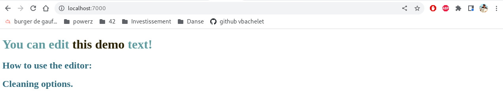
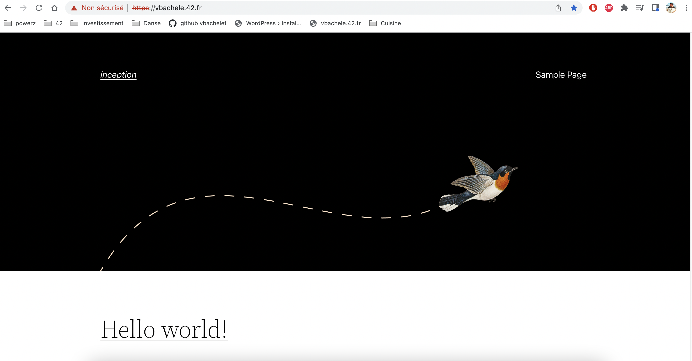
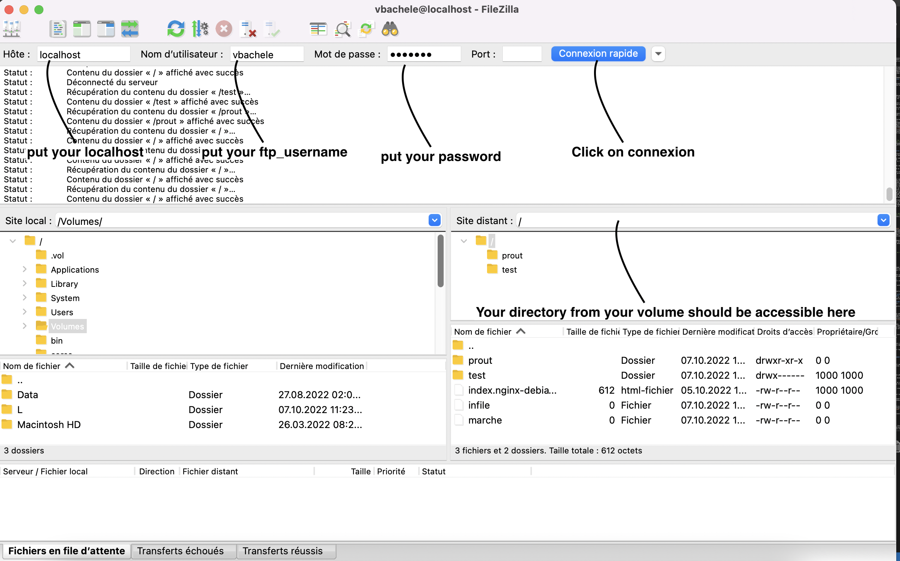
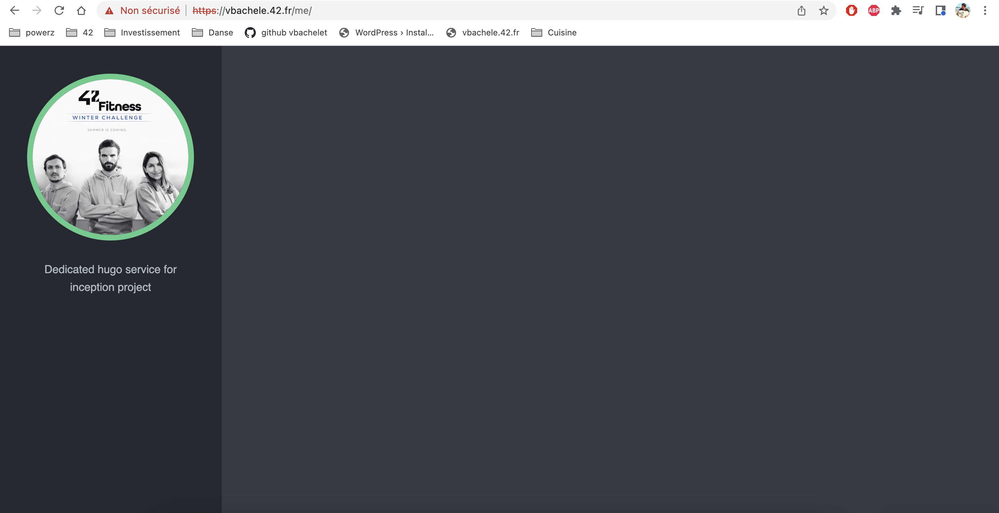
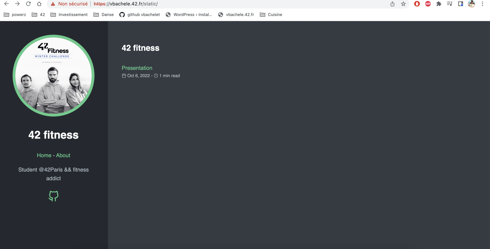

# Inception

This project from 42 school aims to broaden your knowledge of system administration by using Docker. IIn this tutorial You will virtualize several Docker images, creating them in your new personal virtual machine. In this read.me you will have an inception tutorial to know how the project works.

## Important things to read before beginning the project

1. **Don't try to do all the containers** (Nginx, wordpress and mariaDB) at the same time.
You will be lost and you will not understand properly how it works. Do it step by step.

2. **Begin with Nginx** by displaying an index.html page 
	- Learn first how to launch a docker image && to execute this image **without using docker-compose**
	- Learn How to display an html page on http://localhost:80"
	- Learn how to display an html page with SSL on http://localhost:443"

3. **Do wordpress**
	- You can begin from here the docker-compose file, you don't need it before

4. **Finish with MariaDB.**

You want to try if each container works in general? No worries, you will be able to do it by importing images for wordpress and mariaDB from the hub. (if you read this for the first time, I invite you to begin to read this beautiful READ.ME and put a star on it! It helps!)

- The 2 github which helped me a lot for the project : [llescure](https://github.com/llescure/42_Inception) and [malatini](https://github.com/42cursus/inception)
- This github which helped me for the bonus [twagger](https://github.com/twagger/inception)  

If you have questions: please contact me, I will be glad to give you an answer ! my discord username: vbachele#7949

# SUMMARY

### 1. [DEFINITIONS](https://github.com/vbachele/Inception/blob/main/README.md#definitions)
### 2. [DOCKER](https://github.com/vbachele/Inception/blob/main/README.md#Docker)
### 3. [NGINX](https://github.com/vbachele/Inception/blob/main/README.md#NGINX)
### 4. [WORDPRESS](https://github.com/vbachele/Inception/blob/main/README.md#WORDPRESS)
### 4. [MARIADB](https://github.com/vbachele/Inception/blob/main/README.md#MARIADB)
### 5. [BONUS](https://github.com/vbachele/Inception/blob/main/README.md#BONUS)
- [REDIS](https://github.com/vbachele/Inception/blob/main/README.md#REDIS)
- [FTP-server](https://github.com/vbachele/Inception/blob/main/README.md#FTP-SERVER)
- [Adminer](https://github.com/vbachele/Inception/blob/main/README.md#ADMINER)
- [Service of my choice (hugo)](https://github.com/vbachele/Inception/blob/main/README.md#Service-of-my-choice)
- [Static web page](https://github.com/vbachele/Inception/blob/main/README.md#Static-web-page)

# Definitions
## What is a docker ?
Docker is an open platform for developing, shipping, and running applications. Docker enables you to separate your applications from your infrastructure so you can deliver software quickly. With Docker, you can manage your infrastructure in the same ways you manage your applications. By taking advantage of Docker’s methodologies for shipping, testing, and deploying code quickly, you can significantly reduce the delay between writing code and running it in production.
Docker provides the ability to package and run an application in a loosely isolated environment called a container.

## What is a docker-compose ?
[What is docker in general](https://www.educative.io/blog/docker-compose-tutorial)
[What is docker network](https://www.aquasec.com/cloud-native-academy/docker-container/docker-networking/)
Compose is a tool for defining and running multi-container Docker applications. With Compose, you use a YAML file to configure your application’s services. Then, with a single command, you create and start all the services from your configuration.

## What is a docker-file ?
Docker can build images automatically by reading the instructions from a Dockerfile. A Dockerfile is a text document that contains all the commands a user could call on the command line to assemble an image. Using docker build users can create an automated build that executes several command-line instructions in succession.

## How to install docker on MACOS
For this project, I am on my personal mac so I don't need to use the virtual machine to use a sudo command.
I had to install docker. First, you need:
- I went directly to the docker website and I downloaded docker [Link to the website](https://docs.docker.com/desktop/install/mac-install/)
- I installed docker on the machine
- I tested to run a dockerfile thanks to the command docker run hello-world

## Useful things to know about inception dockers and containers
- On the mac, Apache service is installed by default. I deleted Apache from my computer to avoid any problem with nginx
- If you are at 42 on their computer you should stop these services which are running by default
```c
sudo service nginx stop
sudo service mariadb stop
sudo service apache2 stop
sudo service mysql stop
```

# DOCKER

## Important commands to use docker
- [Best practices for building containers](https://cloud.google.com/architecture/best-practices-for-building-containers)

### General docker commands
```c
- docker ps or docker ps -a //show the names of all the containers you have + the id you need and the port associated.
- docker pull "NameOfTheImage" // pull an image from dockerhub
- docker "Three first letter of your docker" // show the logs of your last run of dockers
- docker rm $(docker ps -a -q) //allow to delete all the opened images
- docker exec -it "Three first letter of your docker" sh // to execute the program with the shell
```

### Docker run

```c
- docker run "name of the docker image" //to run the docker image
- docker run -d, // run container in background
- docker run -p,// publish a container's port to the host
- docker run -P, // publish all exposed port to random ports
- docker run -it "imageName", //le programme continuera de fonctionner et on pourra interagir avec le container
- docker run -name sl mysql, //give a name for the container instead an ID
- docker run -d -p 7000:80 test:latest
```

### Docker image
```c
- docker image rm -f "image name/id", //delete the image, if the image is running you need to kill it first.
- docker image kill "name", //stop a running image,
```

## How to write a docker file
- Create a filename dockerfile
- Write your command inside the doc
- Build the dockerfile with the command "docker build -t "nameYouChoose"."
- Execute the dockerfile with the command: docker run "nameYouChoose"

Here are the most common types of instructions:

- FROM <image> - defines a base for your image. exemple : FROM debian
- RUN <command> - executes any commands in a new layer on top of the current image and commits the result. RUN also has a shell form for running commands.
- WORKDIR <directory> - sets the working directory for any RUN, CMD, ENTRYPOINT, COPY, and ADD instructions that follow it in the Dockerfile. (You go directly in the directory you choose)
- COPY <src> <dest> - copies new files or directories from <src> and adds them to the filesystem of the container at the path <dest>.
- CMD <command> - lets you define the default program that is run once you start the container based on this image. Each Dockerfile only has one CMD, and only the last CMD instance is respected when multiple ones exist.

## How to launch a localhost webpage to test
### **(this point works only on the mac and not the VM)**
### [Watch this Video tutorial](<https://www.youtube.com/watch?v=F2il_Mo5yww&ab_channel=linuxxraza>)
- Create a HTML file with some code in it.
- Create you dockerfile
	- The image will be NGINX : FROM NGINX
	- Use COPY to copy your files into the html directory on NGINX
- Use the command "docker build -t simple ."
- Use the command "docker container run --name="nameofyourchoice" -d -p 9000:80 simple"
	- --name is to give a name to your image
	- -d run the container in background
	- -p publish the container's port to the host. In that case 9000 to 80

# NGINX

## How to set up NGINX (our web server)
- [Video tutorial](<http://nginx.org/en/docs/beginners_guide.html>)
Nginx is a webserver which stores hmtl, js, images files and use http request to display a website.
Nginx conf documents will be used to config our server and the right proxy connexion.

## configure .conf file on nginx
### useful nginx links
- [location explanations](<https://www.digitalocean.com/community/tutorials/nginx-location-directive>)
- [What is a proxy server](<https://www.varonis.com/fr/blog/serveur-proxy>)
- [All nginx definitions](<http://nginx.org/en/docs/http/ngx_http_core_module.html>)
- [Nginx Command line](<https://www.nginx.com/resources/wiki/start/topics/tutorials/commandline/>)
- [PID 1 signal handling && nginx](https://cloud.google.com/architecture/best-practices-for-building-containers#signal-handling)
- [What is TLS(in french)](https://fr.wikipedia.org/wiki/Transport_Layer_Security)

### Listen && Location
- Listen will indicate to the server which request it has to accept:
	Listen can take ports and adresses : exemple Listen 80;
- The location directive within NGINX server block allows to route request to correct location within the file system.
	The directive is used to tell NGINX where to look for a resource by including files and folders while matching a location block against an URL.

## Steps to add in localhost by configuring 
### **(this point works only on the mac and not the VM)**
1. I added to my /var/www/ directory an index html file
2. I configured the default file in etc/nginx/site-enabled/default
3. I added a server bracket with a location to var/www/ in the doc. Save it and reload nginx with 'nginx -s reload'.
4. Because the port host I put when I built was 7000. Go to a web page and put: http://localhost:7000/. It works!!!!


## How to change your localhost by vbachele.42.fr
1. Go to the file /etc/hosts
2. Add the following line : "127.0.0.1 vbachele.42.fr"

## Fastcgi (or how to process PHP with nginx)
### Useful links
- [What is http](https://en.wikipedia.org/wiki/Hypertext_Transfer_Protocol)
- [difference between http && tcp](https://www.goanywhere.com/blog/http-vs-tcp-whats-the-difference#:~:text=TCP%20contains%20information%20about%20what,data%20in%20the%20stream%20contains.)
- [PHP Fast CGI Examples](https://www.nginx.com/resources/wiki/start/topics/examples/phpfcgi/)
- [Why using fastcgi_pass 127.0.0.1:9000](https://serverfault.com/questions/1094793/what-is-this-nginx-location-for-php-fpm-fastcgi-pass-127-0-0-19000-really-doing)
- [Install Nginx with php-fpm in video](https://www.youtube.com/watch?v=I_9-xWmkh28&ab_channel=ProgramWithGio)
- [Fast CGI explanations commands](https://www.digitalocean.com/community/tutorials/understanding-and-implementing-fastcgi-proxying-in-nginx)

PHP-FPM (for fast-cgi Process Manager) runs as an isolated service when you use PHP-FPM.
	Employing this PHP version as the language interpreter means requests will be processed via a TCP/IP socket,
	and the Nginx server handles HTTP requests only, while PHP-FPM interprets the PHP code. Taking advantage of two separate services is vital to become more efficient.
	It features with Wordpress

# Docker-compose
- [tutorial open classroom dockercompose](https://openclassrooms.com/fr/courses/2035766-optimisez-votre-deploiement-en-creant-des-conteneurs-avec-docker/6211624-decouvrez-et-installez-docker-compose)

## Docker-Compose commands
```c
- docker-compose up -d --build, //Create and build all the containers and they still run in the background
- docker-compose ps, //Check the status for all the containers
- docker-compose logs -f --tail 5, //see the first 5 lines of the logs of your containers
- docker-compose stop , //stop a stack of your docker compose
- Docker-compose down, //destroy all your ressources
- docker-compose config, //check the syntax of you docker-compose file
```

## Inside the docker-compose file
All the information about what every line means are in this [tutorial](https://openclassrooms.com/fr/courses/2035766-optimisez-votre-deploiement-en-creant-des-conteneurs-avec-docker/6211677-creez-un-fichier-docker-compose-pour-orchestrer-vos-conteneurs)

# WORDPRESS 
## Useful links
- [What is the wordpress CLI](https://www.dreamhost.com/wordpress/guide-to-wp-cli/#:~:text=The%20WP%2DCLI%20is%20a,faster%20using%20the%20WP%2DCLI.)  
- [Know more about wp-config.php](https://wpformation.com/wp-config-php-et-functions-php-fichiers-wordpress/)  
- [php-fpm - www.conf](https://myjeeva.com/php-fpm-configuration-101.html)  

*definitions*
*wp-config.php* This file tells to your database how to get your files and how to treat them
## What are the steps to create your Wordpress
1. **Create you dockerfile image**
	- Download php-fpm
	- Copy the www.conf file in php/7.3/fpm/pool.d/
	- Create the php directory to enable php-fpm to run
	- Copy the script and launch it
	- Go to the html directory
	- Launch php-fpm

2. **Create a script**
	- Download wordpress
	- Create the configuration file of wordpress
	- Move files from wordpress in the html directory
	- Give the 4th environmental variables for wordpress

3. **Create a www.conf**
You need to edit www.conf and place it in /etc/php/7.3(the usual version of php on 42 vm)/fpm/pool.d and wp-content.php to disable access to the wordpress installation page when you access your site at https://login.42.fr
	- Put listen = 0.0.0.0:9000 to listen to all ports
	- Increase the number for the pm values in order to avoid a 502 page

# MARIADB
MariaDB will be the database to store information about our wordpress users and settings.
In this section we have to create the Mariadb image and create 2 users.

## Useful links
- [Import-export databases](https://www.interserver.net/tips/kb/import-export-databases-mysql-command-line/)  
- [Create and give permissions to a user](https://www.daniloaz.com/en/how-to-create-a-user-in-mysql-mariadb-and-grant-permissions-on-a-specific-database/)  
- [Why create /var/run/mysqld directory](http://cactogeek.free.fr/autres/DocumentationLinux-Windows/LinuxUbuntu/ProblemeMYSQL-mysqld.sockInexistant.pdf)  
- [How to give all privileges for a user on a database](https://chartio.com/resources/tutorials/how-to-grant-all-privileges-on-a-database-in-mysql/)  
- [How to import a data base](https://www.journaldunet.fr/web-tech/developpement/1202663-comment-importer-un-fichier-sql-dans-mysql-en-ligne-de-commande/)  

## MARIADB useful commands
```c
mysql -uroot // To connect on mysql CLI
SELECT User FROM mysql.user; // To see all the users
USE wordpress // To connect on your wordpress database
mysqldump -u username -p databasename > filename.sql // To export the file
mysql -uroot -p$MYSQL_ROOT_PASSWORD $MYSQL_DATABASE < /usr/local/bin/wordpress.sql // To import the file
```

## What are the steps to create your own Maria DB image
1. **Create a dockerfile**
	- Download mariadb-server && mariadb-client
	- To run mariaDB on your container, you have to copy your .sh and the .sql on the /var/local/bin/
	- Give the right to execute your mysqld (which is the daemon for mysql)
	- Launch your script to install mariaDB
	- Then do a CMD to enable the database to listen to all the IPV4 adresses.

2. **Create a script (.sh file)**
	- mysql_install_db initializes the MySQL data directory and creates the system tables that it contains, if they do not exist
	- In this script we downloaded Maria DB on the container, we have to install it and create the root user
	- Then we launch the commandline to give all the privileges to the root user. The function GRANT from mysqlcli (sql command line) gives access (or all access) to a user.

3. **Create your file.sql**
	- 2 options :
		1. You create the database, the user and you give all privileges to the user
			as [malatini did](https://github.com/42cursus/inception/blob/validated/srcs/requirements/mariadb/config/create_db.sql)
		2. You export your own wordpress.sql as I did (and Lea did !!!!)
			- Step 1: Create your admin user on wordpress:
				You might don't know what it is, no prob! It means you will export your admin user from your database in order to put it in your .sql file.
				- Go to your wordpress website (localhost:443) and create your user by using the same username and password as your .env file.
			- Step 2: Export your admin user.sql
				You have to go on your mariaDB container and do the following command
				- mysqldump -u 'username' -p 'databasename' > filename.sql *it will export your user on the filename.sql, please change username, databasename by what you put in your .env file*
				- You have a file called filename.sql in your current directory
				- "cat filename.sql" in your container and copy past to your .sql project.
				- Your .sql is ready now to be imported
			- Step 3: relaunch your docker-compose
				- TADA you will be directly in your website by passing the phase of installation


### Commands to check if all is working
```c
	SHOW DATABASES; // show the databes
	use 'wordpress'; // go in the wordpress databse
	SHOW TABLES; // show all the tables from the database you selected
	SELECT wp_users.display_name FROM wp_users; // display username from wordpress database
	SELECT *  FROM wp_users; // select
```

# BONUS

## REDIS
### Useful links
- [What is redis works with wordpress and what is a cache](https://www.section.io/engineering-education/how-to-set-up-and-configure-redis-caching-for-wordpress/)  
- [How to set up redis (english article)](https://www.vultr.com/docshow-to-setup-redis-caching-for-wordpress-with-ubuntu-20-04-and-nginx/)  
- [how to set up redis(french article)](https://gaelbillon.com/installer-et-configurer-redis-pour-wordpress-en-5-minutes/)  

### Definition
Remote Dictionary Server (Redis) is an in-memory, persistent, key-value database known as a data structure server. One important factor that differentiates Redis from similar servers is its ability to store and manipulate high-level data types (common examples include lists, maps, sets, and sorted sets).

### REDIS useful commands
```c
redis-cli // to connect with the cli
redis-server --protected-mode no // To set up redis when you launch your image
```

### How to set up REDIS
1. **Create a dockerfile**
	- Install redis on it
	- Copy the .sh in your image
	- RUN the .sh

2. **Create a sheel script**
*Redis by default has a redis.conf and we need to modify 3 values on it*
	- Modify the value on the .conf document with the sed function
	- Run the redis-server command to install it

3. **Modify the dockerfile of wordpress**
	- You need to DL the wp-cli and you need to move it it the app directory (/usr/bin/wordpress)
	- Add the installation of redis and php-redis

4. **Modify your script on wordpress file**  
*To do this, we can set directly information in the script for wordpress wpcli command*
- Modify the wp-config.php file
	- Define the redis Host
	- Define the redis Port // To redirect wordpress port on this port
	- Define wp cache key salt
	- Define wp redis password
	- Define wp redis client
- Install the redis-cache plugin, updates and enables it

### How to know your redis is installed on wordpress and running  
1. **Check redis is properly installed on your redis image**  
- Launch the command 'redis-cli -h localhost' on your redis image, your should connect to your localhost. Then do ping and the answer should be PONG. Great your redis is installed.

2. **Check if the plugin is installed on wordpress**
	- Go to your wp-admin panel on wordpress : for me it is https://vbachele.42.fr
	- click on plugins on the left tab
	- If you see "Redis Object Cache", Congrats !, click on settings and you will see Status "Connected" in green

## FTP SERVER

### Useful links
*This is the most difficult of the bonus to do*
- [What is an FTP server?](https://titanftp.com/2022/07/05/what-is-an-ftp-server/)  
- [What is vstftpd](https://en.wikipedia.org/wiki/Vsftpd)  
- [Install an ftp server with wordpress](http://praveen.kumar.in/2009/05/31setting-up-ftps-using-vsftpd-for-wordpress-plugins-auto-upgrade/)  
- [Understand vstftpd.conf file (french version)](https://linux.developpez.com/vsftpd/)  

### Definition
An FTP Server, in the simplest of definitions, is a software application that enables the transfer of files from one computer to another. FTP (which stands for “File Transfer Protocol”) is a way to transfer files to any computer in the world that is connected to the Internet. For wordpress it allows to modify ealisy your files like the wordpress files or your code.

### How to set up your ftp server ?
1. **Create a dockerfile**
	- Download vsftpd (a ftp secure secure server)
	- Copy the .conf in your ftp image
	- Run your script to install ftp_server
	- Run your ftp_server
2. **Modify your docker-composer.yml**
	- Create your image as usual
	- Add the port 20 and 21 (port by default for ftp servers)
	- Put the same volumes as your wordpress && nginx

3. **Create a script to execute**
*In this script we will create a user, give rights*
	- Create a user
	- give him the right to your www files

4. **Create .conf_file**
*In this .conf you will have to configure your file to allow the localhost*

### How you know it works?
I did the test on my macOS (should work everywhere), you have to download filezilla for exemple it is a ftp client which will communicate with our vsftpd server. Once installed as the image shows below, you should see the directory you put in your .conf file with the line *local_root=/var/www/html*. If you add a file in the /var/www/html directory from filezilla, you should be able to see it in you container nginx, wordpress or ftp-server.



## ADMINER

### Definition
Replace phpMyAdmin with Adminer and you will get a tidier user interface, better support for MySQL features, higher performance and more security.

### How to set up adminer  
1. **Create a dockerfile**
	- Download curl && php
	- Download the version of adminer
	- Move the adminer php file to the index.php file (located in var/www/html)
	- Add the user www-data
	- Move your conf file in the php-fpm.d directory

2. **Create a www.conf file**
	- You need to add the listen port (*in my case the 9000*)
	- Add the listen owner and listen group *(in my case : www-data)*

3. **Modify the nginx.conf file**
	- You need to add in your nginx.conf a rule to listen the adminer on the port 9000.
	- It will check if the index.php exist

4. **Modify your docker-compose.yml**
	- Create as usual a docker image adminer in your docker-compose

### How to know adminer is working?  
- You have to put : https://"your_website_name"/adminer *in my case https://vbachele.42.fr/adminer*
- You should be redirect on the adminer connexion page

## Service of my choice 
### Useful links
- [What is hugo](https://gohugo.io/about/what-is-hugo/)  
- [How to set up hugo](https://gohugo.io/getting-started/quick-start/)  
- [Configure hugo (more explanations about .toml file)](https://gohugo.io/getting-started/configuration/#configure-build)  
### Definition
Hugo is a fast and modern static site generator written in Go, and designed to make website creation fun again.

### How to set up hugo?
1. **Modify the docker-compose file**

2. **Create a dockerfile**
	- Download hugo
	- Create and go the dedicate directory (for me the name is *me*)
	- Create your webiste and add your template
	- Copy your toml file to replace the one for your directory

3. **Add a config.toml file**
	- The toml file is used by hugo as a configuration file
	- You need to add the #baseURL with your url
	- Your need to add the theme your downloaded on the dockerfile for my case it is "m10c"

4. **Modify the .nginx file**
	- You have to add a rule to listen the dedicated directory 
	- Add the rule for the proxy pass to listen your container
	- include the params for the proxy for nginx

### How to test your program?
	- You need to go on the URL you passed (my url is *https://vbachele.42.fr/me*)
	- If you see only a blank page, that means your theme is not applied it works but you need to find how to apply the theme.
	- If you see a page it works !


## Static web page
*For this one it is easy, I took the hugo services and I did the following changes.*
1. **Update the .toml file**
	- I changed the .toml file with my theme from the previous bonus to add a page about, presentation and my github link.

2. **Create a dockerfile**

3. **Update your docker-compose.yml**

4. **Update the .nginx conf file**
	- You need to update the .conf file to listen your new image in order to display the website.

4. **Create your static pages**
	- I created the about page in markdown
	- I created the presentation page in markdown

**Here is the website**

